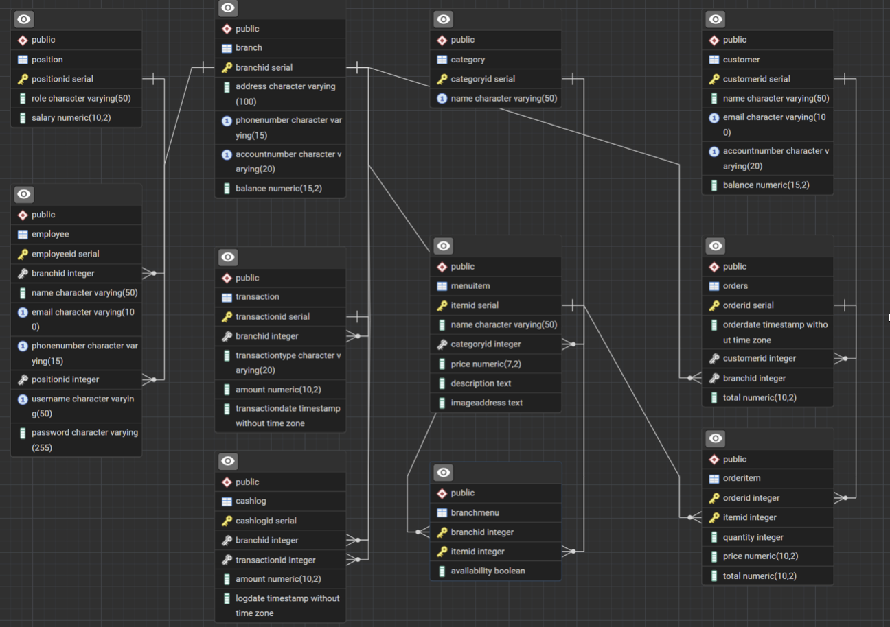
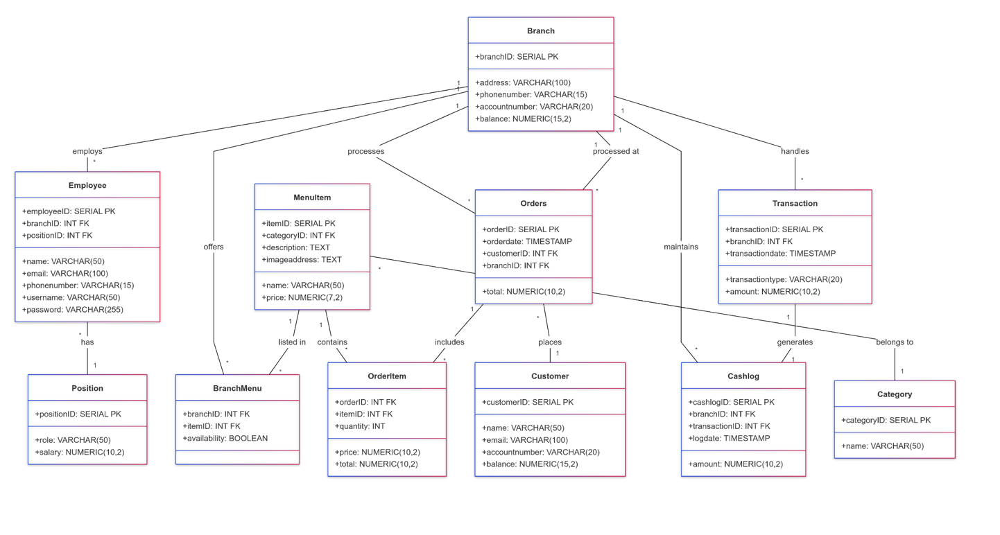
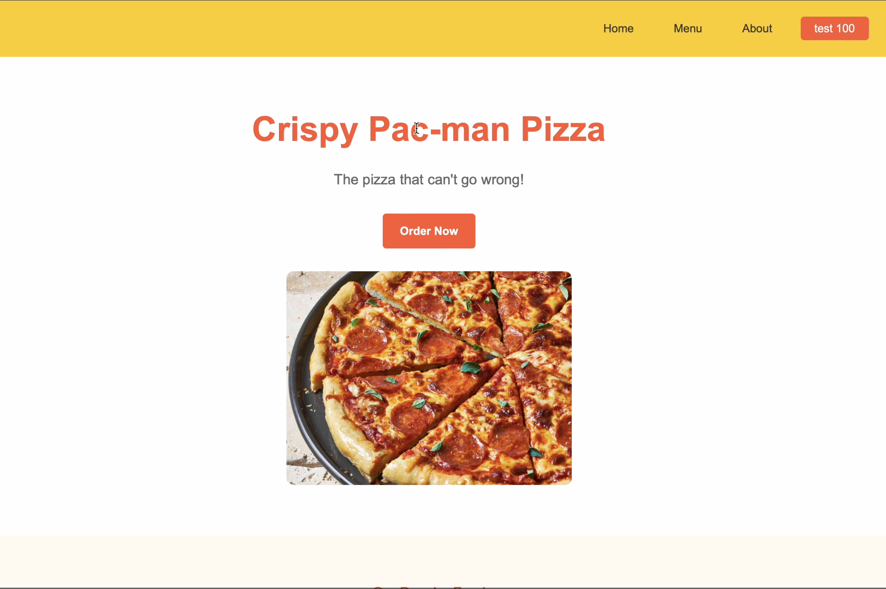
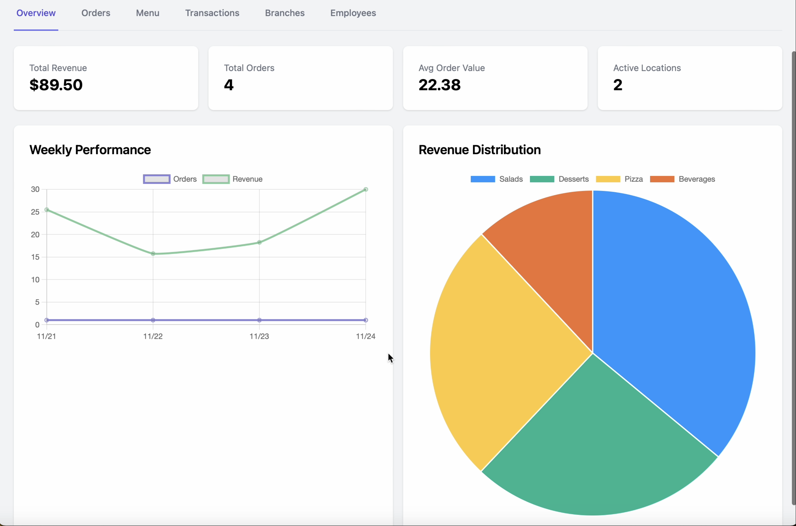

**Course Project - DBMS Class**  
**Group 24: Amrinder Singh, Henri**

## Project Overview
This repository contains a prototype implementation of a database system for a fast food chain. The system manages branches, menus, customers, orders, and transactions through a well-structured relational database design implemented in PostgreSQL.

The system enables:
- Branch management with location tracking and financial reporting
- Menu management with support for branch-specific availability
- Customer account management with balance tracking
- Order processing with complete transaction history
- Employee management with role-based access

> **Note:** This represents a prototype version developed as part of our DBMS class project. Some aspects of the implementation may require further refinement for production use.

## 1. Database Architecture

### Core Tables
The database consists of the following main entities:

| Table       | Description                             |
|-------------|-----------------------------------------|
| Branch      | Store locations and financial tracking  |
| Customer    | Customer profiles and account details   |
| Category    | Food category classifications           |
| MenuItem    | Individual food items with details      |
| BranchMenu  | Branch-specific menu availability       |
| Orders      | Customer order information              |
| OrderItem   | Items within each order                 |
| Transaction | Payment records for accounting          |
| Cashlog     | Cash flow tracking                      |
| Position    | Employee roles and information          |
| Employee    | Staff profiles with authentication      |

### Normalization
- All tables satisfy **3NF/BCNF** requirements
- Primary and composite keys are implemented where appropriate
- \`OrderItem\` utilizes a composite key formed by \`orderID\` and \`itemID\`
- \`Transaction\` uses \`transactionID\` as the primary key

### Database Diagrams

#### Database Schema

#### UML Class Diagram

## 2. Relationship Design

### Key Relationships
- Branch → Order, Transaction, Employee (One-to-Many)
- Customer → Order (One-to-Many)
- MenuItem → Category (Many-to-One)
- Order → OrderItem (One-to-Many)
- Branch ↔ MenuItem (Many-to-Many through BranchMenu)

Branch serves as the central entity, connecting employees, transactions, and orders with proper foreign key constraints as shown in the schema diagram.

## 3. Key SQL Queries

### Menu Item Availability
\`\`\`sql
SELECT mi.itemID, mi.name, mi.price, mi.description, mi.imageaddress 
FROM MenuItem mi 
JOIN BranchMenu bm ON mi.itemID = bm.itemID 
WHERE bm.branchID = $1 AND bm.availability = TRUE;
\`\`\`

## 4. Transaction Processing Logic

### Customer Registration Flow
- Check if customer already exists
- If not, create new customer record 
- Initialize account with default balance

### Order Processing Workflow
1. Verify customer exists and has sufficient balance
2. Create new order record
3. Insert individual order items
4. Update customer and branch balances
5. Record transaction details

### Transaction Implementation
\`\`\`sql
BEGIN;
  -- Check balance and create order
  -- Update customer and branch balances
  -- Record transaction details
COMMIT;
\`\`\`

## 5. Testing and Performance

We implemented a "Test 100" feature that simulates 100 random transactions to validate functionality, ensuring transaction consistency, concurrency handling, and proper error management.

## 6. User Interface

### Customer-Facing Interface
  
*Home page with menu browsing and ordering interface*

### Administrative Dashboard
  
*Administrative dashboard with sales analytics and order management*

## Technology Stack
- **Backend**: Node.js, Express.js
- **Database**: PostgreSQL
- **Frontend**: HTML/CSS, JavaScript, EJS templates
- **Authentication**: Express-session
- **Additional Libraries**: bcrypt, cors, body-parser
- **Transaction Management**: ACID-compliant logic with PostgreSQL

## Contributors
- **Amrinder Singh**
- **Henri**

---

*This project was developed as part of our Database Management Systems course.*`;

console.log("The content is in proper Markdown format. Here's a preview of how it renders:");
console.log(artifact);
